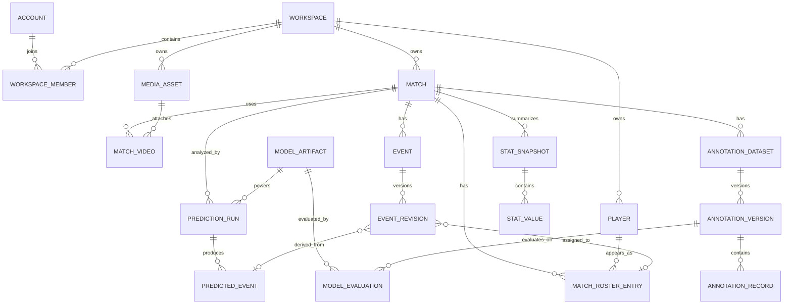
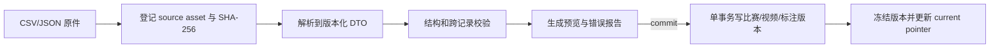
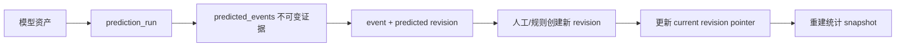

# Spike-Trace 数据平台架构设计

状态：提议，待上游任务评审
日期：2026-08-10
负责 Lane：`data-workspace`

## 1. 目标与非目标

### 1.1 目标

- 长期保存比赛、视频、标注版本、模型产物、模型评估、事件修订、球员归属和统计投影。
- 保留当前文件流水线的来源哈希、格式版本、人工修正和按比赛隔离规则。
- 为本机单用户 MVP 提供简单部署，同时为未来账户登录、多工作区和协作保留稳定边界。
- 让 CSV/JSON 成为受版本控制的交换格式，而不是内部唯一事实库。
- 让统计从可追溯事件重算；改变公式时可以产生新统计版本而不覆盖旧结果。
- 为 CLI、桌面前端和未来本地 HTTP 服务提供相同的应用服务接口。

### 1.2 非目标

- 第一阶段不实现数据库、API、页面或迁移程序。
- 首版不引入微服务、云端 Postgres、远程对象存储、支付、组织计费或密码管理。
- 不定义全局导航、视频分析工作台或标注交互细节。
- 不把动作分类、号码识别、统计规则合并成一个不可替换模块。

## 2. 存储选型

推荐采用三层本地存储：

1. **SQLite 事实库**：结构化实体、关系、版本、任务、审计和统计投影。
2. **内容寻址对象目录**：视频、模型、证据片段、导入原件和导出产物。
3. **可恢复临时目录**：分块导入、导出构建和原子替换前的中间文件。

建议工作区磁盘布局：

```text
<workspace-root>/
├─ workspace.sqlite3
├─ objects/
│  └─ sha256/ab/<64-character-digest>
├─ imports/
│  └─ <import-job-id>/source/<original-name>
├─ exports/
│  └─ <export-job-id>/...
├─ tmp/
│  └─ <job-id>/...
└─ locks/
   └─ writer.lock
```

SQLite 运行约束：

- 启用 `PRAGMA foreign_keys = ON`。
- 使用 WAL 模式，允许多个读取者和一个写入者。
- 所有业务写入经 Unit of Work 事务提交。
- schema 版本由 `schema_migrations` 表管理，不依赖手工修改数据库。
- 数据库和对象目录必须位于同一工作区根目录，便于完整备份。
- 默认是应用管理的 `managed` 资产；用户也可选择 `linked` 外部视频，数据库仍保存哈希、大小和最近验证状态。

不建议把视频或 checkpoint 作为 SQLite BLOB：大文件会放大备份、迁移、WAL 和损坏恢复成本。也不建议继续用纯 JSON 目录做事实库：跨实体查询、事务、权限和统计重算会迅速变得脆弱。

## 3. 标识、时间与通用字段

### 3.1 稳定标识

- 所有公开实体 ID 使用 UUIDv7 字符串，SQLite 列类型为 `TEXT`。
- 文件名、路径、CSV 行号、球衣号码和 `model_version` 都不是主键。
- 球衣号码属于 roster 关系，可随比赛变化；球员主键保持稳定。
- 可被人工修正的对象分为“稳定聚合 ID”和“不可变 revision ID”。

### 3.2 时间

- 数据库时间戳统一保存 UTC ISO 8601 文本，例如 `2026-08-10T08:30:00.000Z`。
- 视频时间统一保存整数毫秒 `start_ms/end_ms`，满足 `0 <= start_ms < end_ms`。
- 导入秒数时使用十进制定点解析并转换为毫秒，避免二进制浮点哈希差异。
- 若来源精度低于 1 毫秒，额外保存 `source_time_precision_ms` 和原始文本。
- 前端按账户时区展示日期；视频时间始终是相对媒体开始的时间，不做时区转换。

### 3.3 通用可变实体字段

可变聚合根至少包含：

```text
id, workspace_id, created_at, updated_at, deleted_at, row_version
```

- `row_version` 每次可变元数据更新递增，用于 ETag/乐观并发。
- `deleted_at` 是可恢复软删除；对象文件只有在无任何活动/历史引用后才进入垃圾回收。
- 不可变版本表没有 `updated_at`；修正通过插入新版本完成。

## 4. 领域模型

### 4.1 关系概览



### 4.2 账户与工作区

#### `accounts`

保存本机身份与偏好，不等同于云端认证凭证：

```text
id, display_name, email_nullable, locale, timezone,
default_workspace_id_nullable, avatar_asset_id_nullable,
created_at, updated_at, row_version
```

首版启动时可自动创建一个 `local` 账户。密码哈希、OAuth token 和订阅状态不进入首版 schema；将来接入认证时放在独立 identity adapter 中。

#### `workspaces`

```text
id, name, slug, owner_account_id, storage_root,
asset_mode(managed|linked|mixed), locale, timezone,
created_at, updated_at, deleted_at, row_version
```

`storage_root` 仅供后端使用，API 默认不返回绝对路径。

#### `workspace_members`

```text
workspace_id, account_id, role(owner|editor|viewer),
status(active|invited|disabled), joined_at
```

首版只有 owner 也应写入成员表，避免以后从单用户 schema 迁移到多用户时重建所有授权关系。

### 4.3 比赛、媒体和球员

#### `media_assets`

```text
id, workspace_id, kind(video|model|image|document|export|import_source|evidence_clip),
storage_mode(managed|linked), sha256, byte_size, media_type,
object_key_nullable, linked_path_nullable, original_name,
availability(available|missing|changed|quarantined),
created_at, last_verified_at, deleted_at
```

- `sha256 + byte_size` 在工作区内唯一，用于幂等导入和去重。
- linked 文件每次使用前可重新校验；内容变化会标记为 `changed`，不会静默把旧资产 ID 指向新内容。
- 任意导入原件也登记为资产，保证以后可证明数据库内容来自哪一份文件。

#### `videos`

视频专用元数据与文件资产一对一：

```text
id, workspace_id, media_asset_id,
fps_num, fps_den, frame_count, width, height, duration_ms,
codec_nullable, rotation_degrees, inspection_status, inspected_at
```

使用 `fps_num/fps_den` 而不是单个浮点数保存精确帧率。

#### `matches`

```text
id, workspace_id, external_key_nullable, name,
competition_nullable, season_nullable, played_at_nullable,
our_team_id_nullable, opponent_team_id_nullable,
status(draft|ready|analyzing|review|complete|archived),
current_annotation_version_id_nullable,
created_at, updated_at, deleted_at, row_version
```

`external_key` 可保存当前 `match_id`，但不能在工作区内重复。

#### `match_videos`

```text
match_id, video_id, role(primary|alternate|broadcast|evidence),
time_offset_ms, sort_order
```

允许未来多机位；首版每场通常只有一个 `primary` 视频。

#### `teams`、`players`、`match_roster_entries`

```text
teams: id, workspace_id, name, short_name, external_key_nullable
players: id, workspace_id, display_name, external_key_nullable, notes_nullable
match_roster_entries: id, match_id, team_id, player_id_nullable,
                      jersey_number, role_nullable, is_our_team,
                      valid_from_ms_nullable, valid_to_ms_nullable
```

- 号码是 roster entry 字段，不是 player 主键。
- 身份尚未确认时允许 `player_id = NULL`，但可先保存候选号码和置信度到事件修订。
- 同一时间范围内，同队同号码不能映射到两个活动 roster entry。

### 4.4 标注数据集与不可变版本

#### `annotation_datasets`

一个比赛可以有多个用途不同的数据集，例如动作分类、号码 OCR 或结果判断：

```text
id, workspace_id, match_id, kind(action_window|identity|outcome),
name, current_version_id_nullable, created_at, updated_at, row_version
```

#### `annotation_versions`

```text
id, workspace_id, dataset_id, parent_version_id_nullable,
revision_number, format_version, label_schema_version,
status(draft|frozen|superseded), source_kind(import|review|expansion|manual|migration),
source_asset_id_nullable, source_sha256_nullable,
created_by_account_id, created_at, message,
record_count, duration_ms, content_sha256
```

约束：

- 版本行冻结后不可变。
- `revision_number` 在 dataset 内唯一且严格递增。
- `parent_version_id` 必须属于同一 dataset，禁止形成环。
- `content_sha256` 由稳定字段排序后的规范化记录计算，不依赖本机绝对路径或 CSV 换行。
- 更新 `current_version_id` 需要匹配 dataset 的 `row_version`，避免两次人工操作互相覆盖。

#### `annotation_records`

```text
id, workspace_id, annotation_version_id, source_record_id_nullable,
video_id, start_ms, end_ms, label, split,
team_side_nullable, roster_entry_id_nullable,
crop_x1_nullable, crop_y1_nullable, crop_x2_nullable, crop_y2_nullable,
review_status, notes_nullable, source_time_precision_ms,
sort_order, record_content_sha256
```

- 每个新版本拥有自己的不可变记录集合。
- `source_record_id` 指向父版本中的对应记录，新增窗口可为空。
- 从现有 CSV 导入时生成稳定 UUID，并把原行号记录在 import mapping 中；后续不再依赖行号作为身份。
- split 验证以比赛为单位，禁止同一 match 跨 train/val/test。

#### `annotation_change_sets` 与 `annotation_changes`

保存二次复核和补标的操作语义：

```text
change_set: id, workspace_id, dataset_id, base_version_id, result_version_id,
            kind(review|expansion|manual), status, created_by, created_at,
            source_asset_id_nullable, source_sha256_nullable
change: id, change_set_id, operation(keep|relabel|move_window|add_window|remove_window),
        source_record_id_nullable, result_record_id_nullable,
        before_snapshot_json_nullable, after_snapshot_json_nullable,
        reason_nullable, evidence_json_nullable, sort_order
```

这把当前复核结果中的来源快照和操作类型迁移为可查询审计，不丢失现有安全语义。

### 4.5 模型产物、运行与评估

#### `model_artifacts`

```text
id, workspace_id, media_asset_id, model_type,
display_version, artifact_format_version, label_schema_version,
labels_json, framework, framework_version_nullable,
created_at, training_run_id_nullable, metadata_json
```

唯一模型身份由 `media_asset.sha256` 确定；`display_version` 只是人类可读标签。

#### `training_runs`

```text
id, workspace_id, annotation_version_id, model_type,
status(queued|running|succeeded|failed|canceled),
config_json, code_version, environment_json,
started_at, completed_at, output_model_artifact_id_nullable,
metrics_json_nullable, error_code_nullable, error_detail_nullable
```

#### `model_evaluations`

```text
id, workspace_id, model_artifact_id, annotation_version_id,
evaluation_contract_version, label_schema_version,
code_version, settings_json, environment_json,
metrics_json, compatibility_metrics_json_nullable,
evidence_asset_id_nullable, created_at
```

评估必须同时绑定确切模型哈希和确切标注版本，禁止只用模型名称或 manifest 路径作为身份。

#### `prediction_runs` 与 `predicted_events`

```text
prediction_run: id, workspace_id, match_id, video_id, model_artifact_id,
                status, settings_json, code_version, started_at, completed_at,
                raw_output_asset_id_nullable, error_code_nullable
predicted_event: id, workspace_id, prediction_run_id,
                 start_ms, end_ms, action, confidence,
                 team_side_nullable, jersey_number_candidate_nullable,
                 identity_confidence_nullable, source, evidence_json
```

原始模型预测永久保留，不因人工确认而修改。

### 4.6 已确认事件与修订

#### `events`

```text
id, workspace_id, match_id, current_revision_id,
created_at, deleted_at, row_version
```

#### `event_revisions`

```text
id, workspace_id, event_id, parent_revision_id_nullable, revision_number,
start_ms, end_ms, action, outcome_nullable,
team_side_nullable, roster_entry_id_nullable,
status(predicted|needs_review|confirmed|rejected),
confidence_nullable, source(prediction|human|import|rule),
source_predicted_event_id_nullable,
created_by_account_id_nullable, created_at,
reason_nullable, evidence_json_nullable, content_sha256
```

- 人工确认创建新 revision，不能覆盖 predicted revision。
- `events.current_revision_id` 是可变指针，更新需 ETag。
- 拒绝预测也形成 revision 或审核决定，不能直接删除原始预测。
- 号码识别模块只产生候选；确认后通过 `roster_entry_id` 归属球员。

### 4.7 统计定义与投影

#### `stat_definitions`

```text
id, key, version, scope(player_match|player_set|team_match),
unit(count|ratio|seconds|grade), formula_text,
required_event_contract_version, created_at, retired_at_nullable
```

#### `stat_snapshots` 与 `stat_values`

```text
stat_snapshot: id, workspace_id, match_id, source_event_revision_set_sha256,
               stat_definition_set_version, generated_at, generator_version,
               status(current|superseded|failed)
stat_value: id, snapshot_id, stat_definition_id,
            roster_entry_id_nullable, set_number_nullable,
            numerator_nullable, denominator_nullable, numeric_value,
            evidence_event_ids_json
```

规则：

- 事件和 roster 归属是事实，统计是可删除重建的投影。
- 比率同时保存分子、分母和值，避免只剩无法审计的百分比。
- 公式变化创建新的 stat definition version 和 snapshot。
- 用户导入统计 CSV 时标记为 `imported` 外部快照，不能冒充从事件重算的结果。

### 4.8 导入、导出和审计

#### `import_jobs`

```text
id, workspace_id, requested_by, kind, contract_version,
source_asset_id, source_sha256, idempotency_key_nullable,
mode(validate_only|commit), status,
started_at, completed_at, summary_json, error_report_json
```

#### `export_jobs`

```text
id, workspace_id, requested_by, kind, contract_version,
selection_json, status, started_at, completed_at,
result_asset_id_nullable, manifest_sha256_nullable, error_report_json_nullable
```

#### `audit_log`

```text
id, workspace_id, actor_account_id_nullable,
action, resource_type, resource_id,
request_id_nullable, before_json_nullable, after_json_nullable,
created_at
```

审计日志不保存密码、token、视频二进制或过大的模型证据。

## 5. 版本策略

版本分为六层，不能用一个全局数字代替：

| 层 | 示例 | 何时升级 | 兼容原则 |
| --- | --- | --- | --- |
| 数据库 schema | `schema_migrations.version` | 表、列、索引或约束变化 | 只通过迁移脚本前进；备份后迁移 |
| API | `/api/v1` | 破坏性资源或响应变化 | v1 内只做向后兼容扩展 |
| 交换格式 | `format_version` | CSV/JSON 字段语义或 envelope 变化 | 导入器显式列出支持版本 |
| 标签契约 | `action_label_schema_version = 2` | 标签集合/语义变化 | 版本绑定标注、模型和评估 |
| 领域修订 | `revision_number` + `parent_revision_id` | 人工或规则修正事实 | 历史不可变；当前指针乐观更新 |
| 统计定义 | `stat_definition.version` | 公式或口径变化 | 新旧快照并存，不重写旧报表 |

迁移规则：

1. 每次数据库迁移在单事务内执行并写入版本、校验和、应用时间和应用程序版本。
2. 迁移前生成数据库备份；对象文件不复制，但校验引用完整性。
3. 不支持的未来格式必须明确失败，不能“尽量解析”。
4. 可兼容的旧格式先转换为当前内部 DTO，再写入数据库；保留原始资产与原版本。
5. 任何重新解释旧标签或统计的行为都产生新版本，不能原地改写历史。

## 6. 存储服务边界

未来 `src/spiketrace/storage/**` 建议只包含数据基础设施，不让业务代码依赖 SQLite 细节：

```text
storage/
├─ database.py          # 连接、事务、PRAGMA、备份
├─ migrations/          # 单向 schema 迁移
├─ unit_of_work.py      # 事务边界
├─ repositories/        # 按聚合根持久化
├─ object_store.py      # 内容寻址文件资产
├─ import_export/       # CSV/JSON adapters
└─ errors.py            # 可映射到 CLI/API 的稳定错误
```

领域/application 层只依赖接口：

```text
WorkspaceRepository
MatchRepository
AnnotationRepository
ModelRepository
EventRepository
StatisticsRepository
AssetStore
UnitOfWork
```

仓储方法返回领域 DTO，不返回 SQLite row、游标或绝对路径。跨聚合操作由应用服务控制事务，例如：

```text
ImportAnnotationManifest
CreateAnnotationRevision
RegisterModelArtifact
RecordModelEvaluation
CreatePredictionRun
ConfirmEventRevision
RebuildStatistics
ExportWorkspaceSelection
```

## 7. API 边界

### 7.1 原则

- 前端、CLI 和未来自动化调用相同的应用服务；HTTP 只是适配器。
- 所有工作区资源路径都包含 `workspace_id`，服务端再次验证资源归属。
- 默认不返回绝对文件路径；媒体通过 `asset_id`、显示名称和受控读取接口访问。
- 重任务返回 job 资源，不阻塞 HTTP 请求。
- 创建类命令支持 `Idempotency-Key`；修改当前指针要求 `If-Match`。
- 错误使用稳定 `code`，不要让前端解析英文异常文本。

### 7.2 建议资源

```text
GET    /api/v1/me
PATCH  /api/v1/me

GET    /api/v1/workspaces
POST   /api/v1/workspaces
GET    /api/v1/workspaces/{workspace_id}
PATCH  /api/v1/workspaces/{workspace_id}
GET    /api/v1/workspaces/{workspace_id}/members

GET    /api/v1/workspaces/{workspace_id}/matches
POST   /api/v1/workspaces/{workspace_id}/matches
GET    /api/v1/workspaces/{workspace_id}/matches/{match_id}
PATCH  /api/v1/workspaces/{workspace_id}/matches/{match_id}

POST   /api/v1/workspaces/{workspace_id}/videos:import
GET    /api/v1/workspaces/{workspace_id}/videos/{video_id}

GET    /api/v1/workspaces/{workspace_id}/matches/{match_id}/annotation-versions
POST   /api/v1/workspaces/{workspace_id}/matches/{match_id}/annotation-versions
POST   /api/v1/workspaces/{workspace_id}/annotation-versions/{version_id}:freeze

GET    /api/v1/workspaces/{workspace_id}/models
GET    /api/v1/workspaces/{workspace_id}/model-evaluations
POST   /api/v1/workspaces/{workspace_id}/model-evaluations

GET    /api/v1/workspaces/{workspace_id}/matches/{match_id}/events
POST   /api/v1/workspaces/{workspace_id}/events/{event_id}/revisions

GET    /api/v1/workspaces/{workspace_id}/players
GET    /api/v1/workspaces/{workspace_id}/players/{player_id}/statistics
POST   /api/v1/workspaces/{workspace_id}/matches/{match_id}/statistics:rebuild

POST   /api/v1/workspaces/{workspace_id}/imports
GET    /api/v1/workspaces/{workspace_id}/imports/{job_id}
POST   /api/v1/workspaces/{workspace_id}/exports
GET    /api/v1/workspaces/{workspace_id}/exports/{job_id}
```

路径中的 `:import`、`:freeze` 和 `:rebuild` 表示业务命令，不应伪装成普通 CRUD 更新。

### 7.3 响应和错误 envelope

成功响应：

```json
{
  "data": {},
  "meta": {
    "request_id": "019f...",
    "api_version": 1
  }
}
```

错误响应：

```json
{
  "error": {
    "code": "annotation_version_conflict",
    "message": "The annotation dataset changed before this revision was applied.",
    "field_errors": [],
    "retryable": false
  },
  "meta": {
    "request_id": "019f...",
    "api_version": 1
  }
}
```

建议稳定错误码至少包括：

```text
validation_failed
unsupported_format_version
asset_missing
asset_content_changed
workspace_access_denied
resource_not_found
row_version_conflict
annotation_version_conflict
split_leakage
duplicate_import
storage_full
job_failed
```

## 8. 数据流

### 8.1 导入现有标注



### 8.2 模型预测到已确认事件



### 8.3 统计重建

1. 锁定比赛当前事件 revision 集合和 roster 版本。
2. 计算来源集合 SHA-256。
3. 使用明确的统计定义版本计算分子、分母和值。
4. 写入新 snapshot 和 evidence event IDs。
5. 单事务把新 snapshot 标为 current，旧 snapshot 标为 superseded。

## 9. 并发、恢复与完整性

- 首版明确为“多读单写”；后台训练不直接持有数据库写锁，只在状态更新和结果登记时短事务写入。
- 对象先写 `tmp`，计算 SHA-256、`fsync` 并原子移动到内容地址，再在数据库事务中建立引用。
- 数据库提交失败时，无引用对象进入待回收列表；对象写入失败时不提交数据库引用。
- 导入和导出 job 可重试；同一工作区相同 `idempotency_key + source_sha256` 返回原 job。
- 定期数据健康检查验证外键、当前指针、对象存在性、对象哈希、split 泄漏和统计来源。
- 备份由 SQLite 在线备份 + 对象引用清单组成；恢复先校验 manifest，再替换工作区。
- 删除工作区是二次确认的软删除；物理清理为独立、可预览、可取消任务。

## 10. 安全与隐私

- API 不返回任意本机绝对路径，不允许前端提交 `../../` 等路径穿越。
- linked 资产只允许由桌面文件选择器授予的路径，服务端保存规范化结果。
- 导入 JSON 不得指定数据库表名、SQL、对象目标路径或宿主命令。
- 导出默认不包含原始视频和模型权重；包含大文件必须显式选择并显示估算大小。
- 审计日志避免记录 token、密码、视频二进制和完整异常堆栈。
- 未来云同步必须建立在工作区成员授权上，不能把本地 `owner` 假定为远程身份。

## 11. 迁移顺序建议

第一阶段只有设计。后续实施建议按以下顺序拆分，每一步都保持现有 CLI 可用：

1. 建立 SQLite schema、迁移器、对象存储和数据库健康检查。
2. 实现只读导入器，把当前比赛、视频、manifest、复核/补标谱系和评估元数据导入新工作区。
3. 对照现有文件生成语义等价导出，验证记录数、标签分布、时长、哈希映射和来源链。
4. 把新增比赛/视频/标注写入切换到应用服务；保留旧 CSV 输出作为兼容导出。
5. 引入预测事件、事件修订和统计投影。
6. 最后接入账户/工作区页面和本地 API；前端不直接操作数据库。

不建议一开始双写所有旧文件和数据库。推荐“旧文件导入为来源资产，数据库成为新事实库，需要兼容时显式导出”，避免两套可变事实长期漂移。

## 12. 验收标准

- 同一 CSV/JSON 重复导入不会产生重复比赛、资产或版本。
- 任一标注版本能追溯到来源文件、父版本、变更集和创建主体。
- 人工修正不会修改原始预测或历史标注版本。
- 模型评估能唯一定位模型哈希、标注版本、配置、代码和环境。
- 球员统计能从证据事件重建；公式升级不覆盖旧结果。
- 不同工作区之间无法通过 ID 猜测、查询或导出对方数据。
- 导入失败不留下半写数据库状态；对象孤儿可被健康检查发现和安全回收。
- 当前标注 CSV 和事件 JSON/CSV 可以按既有契约导出供现有 CLI/工具继续使用。
